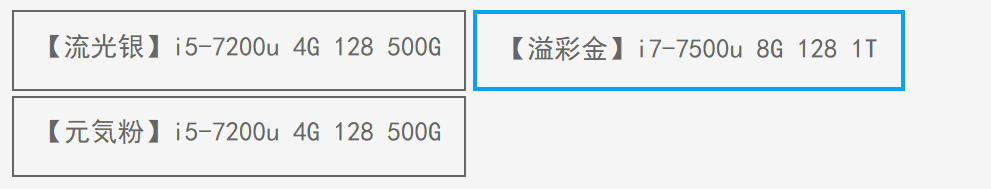

# Vue03

> 提前准备进入项目包 并 启动: `npm run serve`
>
> - 用昨天的包也可以
> - `vscode`必须`1对1` 服务项目

## 复习

> vue2:  https://cn.vuejs.org/v2/api/

选项-配置项 `初始化vue对象时填写`

- el: 指定vue对象管理的DOM元素, 值是id选择器
- render(渲染): 加载 `App.vue` 文件到 vue对象里
- data: 存放数据 可以在页面上展示
- methods: 存放函数 可以在页面上使用

指令: `vue提供的一些属性`

- v-text: innerText 覆盖标签内容,原样输出文本
- v-html: innerHTML 覆盖标签内容, 当HTML解析后显示
- v-show: 利用 css display:none 实现隐藏效果 -- 适合频繁切换隐藏的场景
- v-if: 根据条件 添加/移除元素.  适合不频繁的, 特别是一次性的隐藏/显示
  - v-else
  - v-else-if
- v-for: `最实用`  遍历数组生成元素
  - v-for="值 in/of 数组"
  - v-for="(值, 序号) in/of 数组"
- v-on: 事件绑定语法 .   原生事件 onclick
  - vue2中提供了语法糖: `@事件名`
- v-bind:属性绑定语法
  - vue2中提供语法糖  `:属性名`
- v-pre: 原样显示 `{{}}`
- v-once: 一次性渲染, 后续数据变化 不再更新

脚手架: 目前最流行的开发方式 - `工程化`

- 脚手架是一类软件的总称, 使用npm安装, 其中vue的脚手架名 `@vue/cli`
- 生成包: `vue create 包名`
- 用 自定义方式 配置生成项
- 项目启动: 必须用自带的服务器访问
- 启动服务器命令: `npm run serve`

## 作业

```html
<template>
  <div>
    <!-- 凡是页面上会变化的东西, 必然和数据有关 -->
    <div class="box">
      <div>
        <!-- 动态样式  :class="{类名: true/false}" -->
        <span :class="{ active: item == 'zh' }" @click="item = 'zh'">
          账号登录</span
        >
        <span :class="{ active: item == 'dx' }" @click="item = 'dx'"
          >短信登录</span
        >
      </div>
      <div>
        <!-- ==: 比较, 值一样就行, 类型不一样会自动转一样 -->
        <!-- ===: 比较 值 和 类型都一样 -->
        <div v-show="item == 'zh'">
          <input type="text" placeholder="手机号/用户名/邮箱" />
          <input type="password" placeholder="密码" />
        </div>
        <div v-show="item == 'dx'">
          <input type="text" placeholder="请输入手机号" />
          <input type="text" placeholder="验证码" />
        </div>
      </div>
    </div>
  </div>
</template>

<script>
export default {
  data() {
    return {
      item: 'zh',
    }
  },
}
</script>

<style lang="scss" scoped>
// 如果书写 scss 语法有报错, 说明你生成项目时 没有加载css预编译工具
.box {
  width: 300px;
  background-color: #eee;

  > div:first-child {
    padding: 10px;
    user-select: none;

    span {
      margin-right: 16px;
      color: #666;
      padding-bottom: 4px;
      // & 并且;  相当于 span.active
      &.active {
        color: #000;
        border-bottom: 2px solid blue;
      }
    }
  }
}
</style>

```

## key

没有加key的情况下, vue会尽量复用之前已有的DOM元素, 对变化的位置进行修改


加key的场景中: 

当数组发生变化时, 则直接复用 对应唯一标识的元素 -- 更节省资源,提高性能


> 用喝水的例子
>
> - 不加唯一标识:  把矿泉水瓶 倒掉, 洗干净, 装新的水
> - 加唯一标识: 直接找到你的矿泉水瓶 接着用 - 不用修改
>   - 如果没有, 则重新开一瓶新的

```html

<template>
  <div>
    <!-- 范式 v-for="值 in/of 数组" -->
    <!-- 波浪线: 不是一个实际的错误, 而是 vscode插件觉得你错误 -->
    <!-- 因为 插件推荐你书写一个 key 属性, 存放唯一标识 (不能重复) -->

    <!-- key是什么? 做标记的 -- 当数组发生变化后的重用问题 -->

    <!-- key在数组内容发生修改的时候, 可以提高性能, 直接复用元素 -->
    <!-- 但是 key 仅仅在数组有变化的时候 才有用 -->
    <!-- 数组如果没有变更, 则key没有任何作用 -->

    <!-- 如果值重复, 则不能做唯一标识: 实在没办法用序号 -->
    <!-- 理论上, 数据来自服务器, 服务器的数据必然带有 主键id -->
    <!-- <button v-for="emp in emps" :key="emp">{{ emp }}</button> -->
    <button v-for="(emp, i) in emps" :key="i">{{ i }},{{ emp }}</button>

    <button v-for="(emp, i) in emps">{{ emp }}</button>

    <!-- key有什么用? 为元素添加唯一标识, 方便复用 -->

    <!-- 
      当参加学校举办的运动会, 每个人都喝矿泉水.  需要班级去走方阵... 当走完以后, 回来的时候, 怎么知道哪瓶水 是谁喝的
      -- 解决方案: 做标记即可, 必须是唯一的
     -->
  </div>
</template>

<script>
export default {
  data() {
    return {
      emps: ['壮壮', '浩浩', '文青', '贝贝', '冬冬', '浩浩'],
    }
  },
}
</script>

<style lang="scss" scoped></style>

```

## v-for

```html
<template>
  <div>
    <!-- vue 的for循环, 能够直接遍历数字 -->
    <div class="pages">
      <!-- 遍历的起始值是 1 -->
      <!-- 高亮: nowPage 和 元素自带的p 相同, 就高亮 -->

      <!-- key: 是给vue系统看的, 我们不能主动使用 -->
      <span
        v-for="p in 10"
        :key="p"
        @click="nowPage = p"
        :data-p="p"
        :class="{ active: nowPage == p }"
      >
        {{ p }}
      </span>
    </div>

    <h3>当前页: {{ nowPage }}</h3>
  </div>
</template>

<script>
export default {
  data() {
    return {
      nowPage: 1, // 当前页=1
    }
  },
}
</script>

<style lang="scss" scoped>
.pages {
  background-color: #f5f5f6;
  user-select: none;
  padding: 20px;
  display: flex;

  span {
    width: 40px;
    line-height: 40px;
    text-align: center;
    background-color: white;
    margin-right: 10px;
    border-radius: 5px;
    color: #4e6ef2;

    &.active {
      background-color: #4e6ef2;
      color: white;
    }
  }
}
</style>

```


如果不想看vscode报错, 可以关闭配置中的此项目


v-for


## 练习

```html
<template>
  <div>
    <!-- assets: 专门放资源 -- 图片 -->
    
    
    
    
    

    <hr />
    <!-- i 是序号, 下标 -->
    

    <h2>now:{{ now }}</h2>
  </div>
</template>

<script>
export default {
  data() {
    return {
      now: 0, //当前序号
      // 用数组存储所有的图片地址, 然后用循环方式生成
      imgs: [
        // 图片在JS中使用, 必须用 require 方法引入, 否则无法加载
        // 具体原因与脚手架的webpack工具机制有关, 后期铭铭老师讲解
        require('./assets/heros/Annie.png'),
        require('./assets/heros/Galio.png'),
        require('./assets/heros/Zoe.png'),
        require('./assets/heros/Seraphine.png'),
        require('./assets/heros/LeeSin.png'),
      ],
    }
  },
}
</script>

<style lang="scss" scoped>
img.active {
  border-radius: 50%;
}
</style>

```

## 大小图切换

```html
<template>
  <div>
    <div class="box">
      <!-- 解析: 通过激活的序号, 从imgs数组中得到对应的栏目, 读取其中的大图 -->
      
      <div>
        <!-- 任务: 通过遍历, 把小图 sm 都展示出来 -->
        
      </div>
    </div>
  </div>
</template>

<script>
export default {
  data() {
    return {
      // 大小图切换: 1个大图 对应 1个小图
      imgs: [
        // small:小  large:大
        {
          sm: require('./assets/heros/Annie.png'),
          lg: require('./assets/heros/Annie.jpg'),
        },
        {
          sm: require('./assets/heros/Galio.png'),
          lg: require('./assets/heros/Galio.jpg'),
        },
        {
          sm: require('./assets/heros/Zoe.png'),
          lg: require('./assets/heros/Zoe.jpg'),
        },
        {
          sm: require('./assets/heros/Gwen.png'),
          lg: require('./assets/heros/Gwen.jpg'),
        },
      ],
      now: 0, //当前激活序号
    }
  },
}
</script>

<style lang="scss" scoped>
.box > div > img {
  transition: 0.3s;

  &.active {
    border-radius: 20px;
  }
}
</style>

```

## 计算属性

```html
<template>
  <div>
    <!-- 购物车 -->
    <table>
      <thead>
        <tr>
          <td><input type="checkbox" />全选</td>
          <td>图片</td>
          <td>名称</td>
          <td>价格</td>
          <td>数量</td>
          <td>小计</td>
        </tr>
      </thead>

      <tbody>
        <tr v-for="(p, i) in products" :key="i">
          <td><input type="checkbox" /></td>
          <td></td>
          <td>{{ p.name }}</td>
          <td>¥{{ p.price }}</td>
          <td>
            <!-- disabled 表单元素的属性, 不可用, 不能交互 -->
            <!-- true生效  false不生效 -->
            <button @click="p.count--" :disabled="p.count == 1">-</button>
            <span>{{ p.count }}</span>
            <button @click="p.count++">+</button>
          </td>
          <td>¥{{ p.price * p.count }}</td>
        </tr>
      </tbody>

      <tfoot>
        <tr>
          <!-- methods中的方法, 使用时需要() -->
          <td colspan="6" align="right">合计: {{ total() }}</td>
        </tr>

        <tr>
          <!-- computed中的方法, 使用时不需要() -->
          <td colspan="6" align="right">合计: {{ total2 }}</td>
        </tr>
      </tfoot>
    </table>
  </div>
</template>

<script>
export default {
  data() {
    return {
      // 名字,价格,数量,是否勾选,图片
      products: [
        {
          img: require('./assets/heros/Annie.jpg'),
          name: '哥特萝莉',
          price: 79,
          count: 1,
          checked: false,
        },
        {
          img: require('./assets/heros/Galio.jpg'),
          name: '幽蓝梦魇 加里奥',
          price: 100,
          count: 1,
          checked: false,
        },
        {
          img: require('./assets/heros/Gwen.jpg'),
          name: '咖啡甜心 格温',
          price: 110,
          count: 1,
          checked: false,
        },
        {
          img: require('./assets/heros/LeeSin.jpg'),
          name: '龙的传人 李青',
          price: 1200,
          count: 1,
          checked: false,
        },
      ],
    }
  },
  methods: {
    total() {
      // 遍历商品, 计算所有商品价格的总和
      var sum = 0
      // forEach: 在JS高级 数组高阶函数中讲解的
      this.products.forEach(p => (sum += p.price * p.count))
      return sum
    },
  },
  // 配置项:computed 称为计算属性
  // 作用: 存放在这里的函数, 使用时不用(), 会自动触发. 适合没有参数的函数
  computed: {
    total2() {
      var sum = 0
      this.products.forEach(p => (sum += p.price * p.count))
      return sum
    },
  },
}
</script>

<style lang="scss" scoped>
table {
  // 边框合并
  border-collapse: collapse;

  thead {
    background-color: #eee;
  }

  td {
    border: 1px solid gray;
    padding: 5px 15px;

    img {
      width: 100px;
    }
  }
}
</style>

```

## 双向绑定v-model

```html
<template>
  <div>
    <!-- v-model 指令:  称为 双向数据绑定 -->
    <!-- v-model属于一个智能属性, 会自动判断所在的元素类型, 然后为对应的属性绑定值 -->

    <!-- 方向1: 数据gx 绑定给了 勾选框的checked 属性 -->
    <!-- 方向2: 操作元素的时候, 会自动更新相关的数据 -->
    <input type="checkbox" v-model="gx" />
    <p>当前勾选状态: {{ gx }}</p>

    <!-- 简单说: v-model的作用, 收集用户操作的信息, 例如 勾选框, 单选框, 下拉选框, 输入框... -->
  </div>
</template>

<script>
export default {
  data() {
    return {
      gx: true, //勾选: 初始true
    }
  },
}
</script>

<style lang="scss" scoped></style>

```

## 勾选框练习

```html
<template>
  <div>
    <div>
      <label>
        <!-- 双向绑定特点: 当DOM元素的值变化时, 能自动更新给变量 -->
        {{ agree }}
        <input type="checkbox" v-model="agree" />
        <span>我已阅读并同意用户注册协议</span>
      </label>
    </div>
    <!-- disabled: 不可用 -->
    <button :disabled="!agree">注册账号</button>
  </div>
</template>

<script>
export default {
  data() {
    return {
      agree: false, //同意: 假
    }
  },
}
</script>

<style lang="scss" scoped></style>

```

## 购物车

```html
<template>
  <div>
    <!-- 购物车 -->
    <table>
      <thead>
        <tr>
          <!-- 把计算属性的值 绑定给全选按钮 -->
          <!-- v-model 绑定的是data中的属性 -->
          <!-- isCheckAll: 计算属性, 实际是个函数,不能用v-model -->
          <!-- 勾选框的值被点击后, 发生变化, 触发 change 事件 -->
          <td>
            <input
              @change="chaChanged"
              type="checkbox"
              :checked="isCheckAll"
            />全选
          </td>
          <td>图片</td>
          <td>名称</td>
          <td>价格</td>
          <td>数量</td>
          <td>小计</td>
        </tr>
      </thead>

      <tbody>
        <tr v-for="(p, i) in products" :key="i">
          <td>
            <input type="checkbox" v-model="p.checked" />
            <span>{{ p.checked }}</span>
          </td>
          <td></td>
          <td>{{ p.name }}</td>
          <td>¥{{ p.price }}</td>
          <td>
            <!-- disabled 表单元素的属性, 不可用, 不能交互 -->
            <!-- true生效  false不生效 -->
            <button @click="p.count--" :disabled="p.count == 1">-</button>
            <span>{{ p.count }}</span>
            <button @click="p.count++">+</button>
          </td>
          <td>¥{{ p.price * p.count }}</td>
        </tr>
      </tbody>

      <tfoot>
        <tr>
          <!-- methods中的方法, 使用时需要() -->
          <td colspan="6" align="right">合计: {{ total() }}</td>
        </tr>

        <tr>
          <!-- computed中的方法, 使用时不需要() -->
          <td colspan="6" align="right">合计: {{ total2 }}</td>
        </tr>
      </tfoot>
    </table>
  </div>
</template>

<script>
export default {
  data() {
    return {
      // 名字,价格,数量,是否勾选,图片
      products: [
        {
          img: require('./assets/heros/Annie.jpg'),
          name: '哥特萝莉',
          price: 79,
          count: 1,
          checked: false,
        },
        {
          img: require('./assets/heros/Galio.jpg'),
          name: '幽蓝梦魇 加里奥',
          price: 100,
          count: 1,
          checked: false,
        },
        {
          img: require('./assets/heros/Gwen.jpg'),
          name: '咖啡甜心 格温',
          price: 110,
          count: 1,
          checked: false,
        },
        {
          img: require('./assets/heros/LeeSin.jpg'),
          name: '龙的传人 李青',
          price: 1200,
          count: 1,
          checked: false,
        },
      ],
    }
  },
  methods: {
    // 全选按钮的 状态变化 事件: change
    // 事件触发的, 一定要放在methods里
    chaChanged(e) {
      // 此方法是 勾选框 勾选操作触发的, 如何得到勾选框的 勾选状态?
      // 事件参数
      console.log(e.target.checked) //到后台找 checked 属性在哪
      // 数据中每个商品的 checked 属性, 都应该和全选一样
      this.products.forEach(p => (p.checked = e.target.checked))
    },

    total() {
      // 遍历商品, 计算所有商品价格的总和
      var sum = 0
      // forEach: 在JS高级 数组高阶函数中讲解的
      this.products.forEach(p => (sum += p.price * p.count))
      return sum
    },
  },
  // 配置项:computed 称为计算属性
  // 作用: 存放在这里的函数, 使用时不用(), 会自动触发. 适合没有参数的函数
  computed: {
    // 不带参数的, 判断每一个都是勾选
    isCheckAll() {
      // 每一个元素, 都使用箭头函数判断, 返回真还是假
      return this.products.every(p => p.checked)
    },

    total2() {
      var sum = 0
      // 只累加 勾选状态是 true 的元素
      // 在乘法里, *true 转 *1    *false 转*0
      this.products.forEach(p => {
        sum += p.price * p.count * p.checked
      })
      return sum
    },
  },
}
</script>

<style lang="scss" scoped>
table {
  // 边框合并
  border-collapse: collapse;

  thead {
    background-color: #eee;
  }

  td {
    border: 1px solid gray;
    padding: 5px 15px;

    img {
      width: 100px;
    }
  }
}
</style>

```


## 购物车流程

1. 制作假数据, 在 data 中 `products`, 保存了所有商品
   每个商品包含信息: `名字, 价格, 图片, 数量, 是否勾选`
2. 数据的展示
   - 在HTML中, 使用 table 完成头部栏的制作, 然后添加css样式
   - 完成body的制作, 使用 v-for 把实际数据填充到表格里
   - 完成脚部的制作, tfoot
3. 完成 + 和 -  的制作, 小计功能的实现
   - 利用 disabled 属性, 解决 -1 最小为1 的问题
4. 合计的制作
   - 先: 在methods中制作total方法, 计算总和.  `使用时需要()`来触发
   - 后: 计算属性的引入, 在 `computed` 中制作方法, 使用时不需要()
5. 单选的制作
   - 引入`v-model`概念, 双向绑定: 可以在用户操作勾选时, 影响相关的数据, 就是商品的 checked 属性
   - 重新制作 合计功能, 添加 `*p.checked` , 只计算勾选为真的商品总和
6. 全选按钮的状态 和 单选操作联动
   - 利用数组高阶函数 `every` 来判断是否每个商品都是勾选的
   - 最终结果绑定给 全选按钮的 checked 属性
   - 考虑方法不需要参数, 所以在计算属性中书写 `isCheckAll`
7. 全选按钮的事件: `change`
   - 当全选按钮被点击后, 变更状态, 利用 `事件参数` 来读取元素的 勾选状态值, 然后设置给每个商品的checked属性.  让他们联动

## 输入框

```html
<template>
  <div>
    <!-- 表单元素: 可以收集用户信息的元素 -- 输入框,单选,多选,勾选, 下拉选框 -->

    <!-- v-model: 特点就是 实时更新数据; 所以uname变量中存储的一定是输入框最新的值 -->
    <input type="text" v-model="uname" placeholder="请输入姓名" />
    <div>uname:{{ uname }}</div>
    <br />
    <button @click="showHello">问好</button>
  </div>
</template>

<script>
export default {
  data() {
    return {
      uname: '',
    }
  },
  methods: {
    showHello() {
      alert('欢迎' + this.uname + '光临本店')
    },
  },
}
</script>

<style lang="scss" scoped></style>

```

## 多选框

```html
<template>
  <div>
    <!-- 多选 -->
    <h3>壮壮同学, 请勾选你熟练的技能, 便于本公司挑选人才</h3>
    <p>您勾选的技能: {{ skills }}</p>
    <div>
      <div>
        <input type="checkbox" value="0" v-model="skills" />
        <span>HTML5</span>
      </div>
      <div>
        <input type="checkbox" value="1" v-model="skills" />
        <span>CSS</span>
      </div>
      <div>
        <input type="checkbox" value="2" v-model="skills" />
        <span>JavaScript</span>
      </div>
      <div>
        <input type="checkbox" value="3" v-model="skills" />
        <span>Vue</span>
      </div>
    </div>
  </div>
</template>

<script>
export default {
  data() {
    return {
      // v-model属于一个很智能的属性
      // v-model="变量"
      // 如果变量类型是 boolean, 认为 判断是否勾选, true/false
      // 如果变量类型是 array, 认为 是多选操作, 把值添加到数组里
      skills: [], //多选操作, 使用数组来存储选项
    }
  },
}
</script>

<style lang="scss" scoped></style>

```


## 内容总结

- key: 配合for循环使用的`唯一`标识

  - 作用: 当数组内容发生变化, 根据唯一标识直接复用对应选择, 提高复用的效率
  - 注意: 如果数组不会变化, key毫无作用
  - 不写key 后台不会报错, 但是vscode会报错,因为插件推荐你写key.

- v-for

  - 可以直接遍历数字, 适合页数相关功能.

    `v-for="页数 in 数字"`

- 计算属性

  - 不带参数的函数, 书写在配置项 `computed`中, 使用时不需要`()`
  - 但是: 事件绑定的函数只能在`methods` 中书写, 不能作为计算属性
    - 为什么: 因为事件需要通过事件触发, 而不是自动触发

- v-model: `双向绑定`

  - 表单元素: 输入框, 单选框, 多选框, 下拉选框.. 用户能操作修改值
  - 用v-model 来绑定变量, 可以试试更新变量的值


## 作业

点击时, 高亮点击项目.  要求数据存在数组里, 通过遍历展示到页面上



作业2:

- 购物车: 按照给的购物车思路, 最少得两遍


